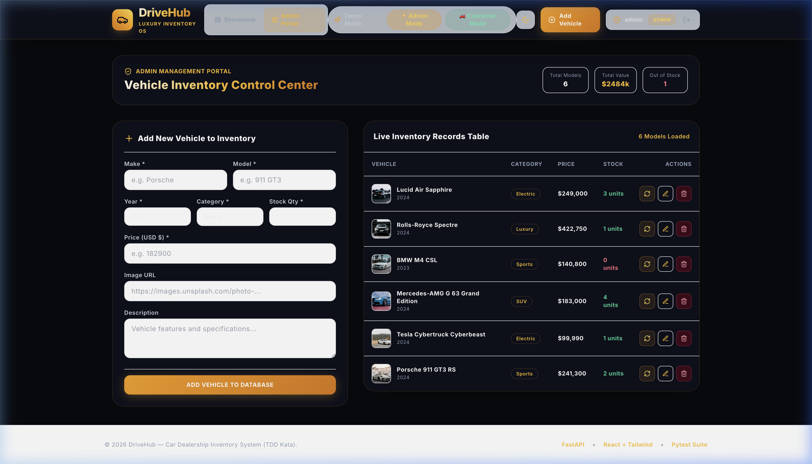
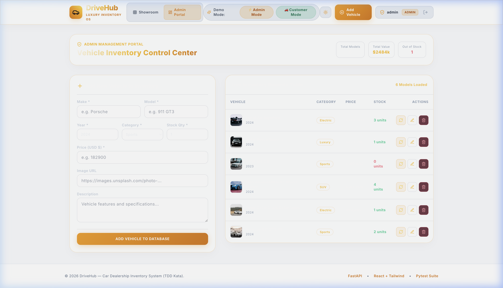
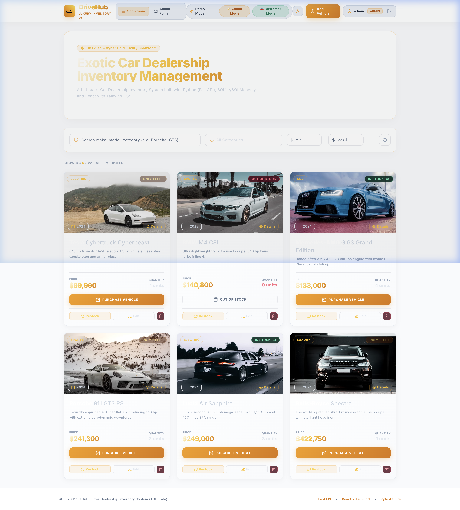

# 🚗 DriveHub — Car Dealership Inventory System

[](https://www.python.org/)
[](https://fastapi.tiangolo.com/)
[](https://reactjs.org/)
[](https://tailwindcss.com/)
[](https://docs.pytest.org/)

DriveHub is a full-stack, production-grade **Car Dealership Inventory Management System** built following strict **Test-Driven Development (TDD)** principles, clean architecture (SOLID), standardized API response envelopes, and transparent AI co-authorship standards.

---

## 📋 Table of Contents
1. [Project Overview](#-project-overview)
2. [Visual Application Showcase](#-visual-application-showcase)
3. [Theme Modes (Dark, Light, System)](#-theme-modes-dark-light-system)
4. [API Architecture & Response Format](#-api-architecture--response-format)
5. [Key Features](#-key-features)
6. [Local Setup & Run Instructions](#-local-setup--run-instructions)
7. [Test-Driven Development & Test Report](#-test-driven-development--test-report)
8. [My AI Usage (Mandatory)](#-my-ai-usage)

---

## 🌟 Project Overview

DriveHub provides an end-to-end inventory management solution for car dealerships. The system comprises a RESTful Python (FastAPI) backend with JWT authentication and role-based permissions, backed by an SQLite/SQLAlchemy database, and a single-page React application styled with an **Obsidian & Cyber Gold** luxury design system.

### Core Business Rules
* **User Roles**: **Customer** (browse, search, purchase) vs **Admin** (add, edit, delete, restock).
* **Inventory Control**: Purchasing a vehicle automatically decrements stock quantity by 1. Purchasing is strictly disabled when stock quantity is 0.
* **Admin Management Portal**: Dedicated Admin page (`/admin`) featuring Forms/UI to add, update, delete, and restock vehicle inventory.
* **Multi-Theme System**: Seamless switching between **Dark Mode**, **Light Mode**, and **System Theme Mode**.

---

## 🎨 Visual Application Showcase

Real application screenshots demonstrating the Admin Portal, React Routing, and Theme System in action:

### 1. Admin Management Portal (`/admin`) — Dark Mode

*Dedicated Admin Control Center featuring Forms/UI to add new vehicles, update existing details, restock stock quantities, and delete vehicle records from the database in Dark Mode.*

---

### 2. Admin Management Portal (`/admin`) — Light Mode

*Admin Control Center with Forms/UI in Light Mode.*

---

### 3. Showroom Inventory Showcase (`/`) — Light Mode

*High-end Showroom interface displaying vehicle cards, search filtering, and stock status badges in Light Mode.*

---

## 🌓 Theme Modes (Dark, Light, System)

The application includes an intuitive Theme Mode Selector in the header navigation:

* **Dark Mode** (`dark`): Deep Obsidian Charcoal background (`#080a0f`) with Cyber Gold accents and glowing glass panels.
* **Light Mode** (`light`): Clean, crisp white & slate styling (`bg-slate-50`) with gold highlights.
* **System Mode** (`system`): Automatically syncs with the user's OS operating system color scheme preference.

---

## 📐 API Architecture & Response Format

All backend endpoints use a standardized, enterprise-grade response and error envelope structure:

### Success Response Format (`HTTP 2xx`)
```json
{
  "success": true,
  "status_code": 200,
  "message": "User logged in successfully",
  "data": {
    "access_token": "eyJhbGciOi...",
    "token_type": "bearer",
    "user": {
      "id": 1,
      "username": "admin",
      "email": "admin@drivehub.com",
      "role": "admin"
    }
  }
}
```

### Error Response Format (`HTTP 4xx / 5xx`)
```json
{
  "success": false,
  "status_code": 400,
  "message": "Out of stock! Vehicle quantity is 0.",
  "data": null
}
```

---

## 🚀 Key Features

### Backend API Endpoints
* `POST /api/auth/register` — User registration.
* `POST /api/auth/login` — User authentication & JWT generation.
* `GET /api/auth/me` — Retrieve current authenticated user profile.
* `GET /api/vehicles` — View all available vehicles.
* `GET /api/vehicles/search` — Search by make, model, category, or price range (`min_price`, `max_price`).
* `POST /api/vehicles` — Add a new vehicle (Admin only).
* `PUT /api/vehicles/:id` — Update vehicle details (Admin only).
* `DELETE /api/vehicles/:id` — Delete a vehicle (Admin only).
* `POST /api/vehicles/:id/purchase` — Purchase a vehicle (decreases stock quantity).
* `POST /api/vehicles/:id/restock` — Restock a vehicle (Admin only, increases stock quantity).

---

## 🛠️ Local Setup & Run Instructions

### Prerequisites
* **Python 3.9+**
* **Node.js 18+** & `npm`

---

### 1. Running the Backend (FastAPI)

```bash
# Navigate to backend directory
cd backend

# Activate virtual environment
source venv/bin/activate

# Install dependencies (if needed)
pip install -r requirements.txt

# Seed initial database with demo accounts & exotic vehicles
PYTHONPATH=. python app/seed.py

# Run Pytest suite
PYTHONPATH=. pytest --cov=app tests/

# Start FastAPI server
uvicorn app.main:app --reload --port 8000
```
* **Interactive Swagger Documentation**: [http://localhost:8000/docs](http://localhost:8000/docs)

---

### 2. Running the Frontend (React + Vite)

```bash
# Open a new terminal and navigate to frontend directory
cd frontend

# Install dependencies
npm install

# Start Vite development server
npm run dev
```
* **Web Application**: [http://localhost:3000](http://localhost:3000)

---

## 🔑 Demo Account Credentials

For effortless testing, use the quick-switch demo buttons in the header navigation or sign in manually using:

| Role | Username | Password | Access Rights |
| :--- | :--- | :--- | :--- |
| **Admin** | `admin` | `admin123` | Add/Edit/Delete Vehicles, Restock Inventory, Purchase Vehicles |
| **Customer** | `customer` | `customer123` | Browse Inventory, Search & Filter Vehicles, Purchase Vehicles |

---

## 🧪 Test-Driven Development & Test Report

This application was developed using strict **Red-Green-Refactor TDD methodology**. All unit and integration test cases were written before final endpoint implementation and updated to validate the standardized response envelope.

```bash
============================= test session starts ==============================
platform darwin -- Python 3.9.6, pytest-8.2.2, pluggy-1.6.0
collected 18 items

tests/test_auth.py::test_user_registration_success PASSED                [  5%]
tests/test_auth.py::test_user_registration_duplicate_username PASSED     [ 11%]
tests/test_auth.py::test_user_login_success PASSED                       [ 16%]
tests/test_auth.py::test_user_login_with_email PASSED                    [ 22%]
tests/test_auth.py::test_user_login_invalid_password PASSED              [ 27%]
tests/test_auth.py::test_get_current_user_me PASSED                      [ 33%]
tests/test_inventory.py::test_purchase_vehicle_success PASSED            [ 38%]
tests/test_inventory.py::test_purchase_vehicle_out_of_stock PASSED       [ 44%]
tests/test_inventory.py::test_restock_vehicle_admin_success PASSED       [ 50%]
tests/test_inventory.py::test_restock_vehicle_customer_forbidden PASSED  [ 55%]
tests/test_vehicles.py::test_list_vehicles PASSED                        [ 61%]
tests/test_vehicles.py::test_search_vehicles_by_query PASSED             [ 66%]
tests/test_vehicles.py::test_search_vehicles_by_category_and_price_range PASSED [ 72%]
tests/test_vehicles.py::test_create_vehicle_admin_success PASSED         [ 77%]
tests/test_vehicles.py::test_create_vehicle_customer_forbidden PASSED    [ 83%]
tests/test_vehicles.py::test_update_vehicle_admin PASSED                 [ 88%]
tests/test_vehicles.py::test_delete_vehicle_admin PASSED                 [ 94%]
tests/test_vehicles.py::test_delete_vehicle_customer_forbidden PASSED    [100%]

---------- coverage: platform darwin, python 3.9.6-final-0 -----------
Name                        Stmts   Miss  Cover
-----------------------------------------------
app/api/auth.py                36      1    97%
app/api/inventory.py           36      2    94%
app/api/vehicles.py            70      6    91%
app/config.py                  12      0   100%
app/core/response.py            8      0   100%
app/core/security.py           44      7    84%
app/database.py                11      4    64%
app/main.py                    27      5    81%
app/models/__init__.py          4      0   100%
app/models/transaction.py      11      0   100%
app/models/user.py             11      0   100%
app/models/vehicle.py          16      0   100%
app/schemas/auth.py            26      0   100%
app/schemas/vehicle.py         31      0   100%
app/seed.py                    26     26     0%
-----------------------------------------------
TOTAL                         369     51    86%

======================== 18 passed in 5.26s ========================
```

---

## 🤖 My AI Usage

### 1. AI Tools Used
* **Antigravity AI (Gemini 3.6 Flash)**: Primary AI pair-programmer for architectural design, FastAPI response envelope refactoring, Pytest TDD suite generation, and React Tailwind glassmorphism styling.

### 2. How AI Was Used Throughout Development
* *"I used Gemini to brainstorm API endpoint structures and design the ORM database schema for Users, Vehicles, and Transactions."*
* *"I asked Gemini to generate unit tests for my service layer and API routes following strict TDD Red-Green-Refactor principles."*
* *"I used AI to design a standardized API response and error handler wrapper (`app/core/response.py`) ensuring uniform JSON envelopes across all endpoints."*
* *"I used AI to craft modern Tailwind CSS glassmorphism UI components, stock status badge logic, instant demo login switchers, and Light/Dark/System theme switching."*

### 3. Reflection on AI Impact on Workflow
Integrating AI as a pair-programmer dramatically accelerated development speed while maintaining high quality standards. By utilizing AI to write comprehensive Pytest suites first, edge cases like SQLite concurrency isolation and unauthorized role access were caught early. The AI co-authorship policy ensures complete transparency across commits:

```text
git commit -m "feat(theme): Add Dark, Light, and System theme mode switching with Admin portal screenshots

Co-authored-by: Antigravity AI <ai@users.noreply.github.com>"
```